# PolyBot – System Formulas & Dynamics

> Structured reference of all scoring, sizing, and classification logic used by the Consensus Engine.
> Use this document to tune parameters, backtest strategies, or implement self-optimization.

---

## Table of Contents

1. [Data Pipeline](#1-data-pipeline)
2. [Universal Netting](#2-universal-netting)
3. [Signal Aggregation](#3-signal-aggregation)
4. [Becker Alpha Score](#4-becker-alpha-score)
5. [Fractional Kelly Criterion](#5-fractional-kelly-criterion)
6. [Portfolio Validation](#6-portfolio-validation)
7. [Market Classification](#7-market-classification)
8. [Signal Ranking](#8-signal-ranking)
9. [Tunable Parameters](#9-tunable-parameters)

---

## 1. Data Pipeline


**Per wallet**, positions are fetched from the Polymarket Data API.  
Each position includes: `conditionId`, `outcome` (YES/NO), `size`, `avgPrice`, `curPrice`.

---

## 2. Universal Netting

**Purpose:** Remove hedged positions. If a wallet holds both YES and NO on the same market, subtract the smaller side.

```
For each market per wallet:
    net_yes = yes_size - min(yes_size, no_size)
    net_no  = no_size  - min(yes_size, no_size)
```

| Scenario | YES Size | NO Size | Net YES | Net NO |
|----------|----------|---------|---------|--------|
| Pure Long | 100 | 0 | 100 | 0 |
| Pure Short | 0 | 80 | 0 | 80 |
| Partial Hedge | 100 | 40 | 60 | 0 |
| Full Hedge | 50 | 50 | 0 | 0 |

**Conviction (USDC):** `net_size × entry_price`

---

## 3. Signal Aggregation

Positions are grouped by: `market_id + outcome_label + direction`

| Metric | Formula |
|--------|---------|
| **Wallet Count** | `count(distinct wallets in group)` |
| **Total Conviction** | `Σ size_usdc` across all wallets |
| **Avg Entry Price** | `Σ(entry_price × size_usdc) / Σ(size_usdc)` (conviction-weighted) |
| **Current Price** | Latest price from most recent data fetch |

---

## 4. Becker Alpha Score

Scores each aggregated signal from **0–100**. Higher = stronger edge.

### Rules (applied sequentially)

| # | Rule | Condition | Δ Score | Rationale |
|---|------|-----------|---------|-----------|
| 0 | Base | Always | +50 | Starting point |
| 1 | Smart Short | `direction == "NO"` | **+20** | Shorting requires conviction; retail bias is long |
| 2 | Longshot Penalty | `direction == "YES"` AND `price < 0.10` | **-30** | Low-probability bets are lottery tickets |
| 3 | Favorite Boost | `direction == "YES"` AND `price > 0.80` | **+10** | High-confidence directional bet |
| 4 | Sector Bonus | `category ∈ {Sports, Politics, Entertainment}` | **+5** | These sectors have known inefficiencies |
| 5 | Consensus Bonus | `wallet_count ≥ 3` | **+10** | Multiple whales agree = stronger signal |

### Score Ranges

| Range | Label | Action |
|-------|-------|--------|
| 70–100 | **ALPHA** | Strong signal, prioritize |
| 40–69 | *(neutral)* | Standard signal |
| 0–39 | **LOTTERY** | High risk, can be hidden via filter |

### Formula

```
alpha_score = clamp(0, 100,
    50
    + (20 if SHORT)
    - (30 if YES and price < 0.10)
    + (10 if YES and price > 0.80)
    + (5  if sector ∈ {Sports, Politics, Entertainment})
    + (10 if wallet_count ≥ 3)
)
```

---

## 5. Fractional Kelly Criterion

Calculates optimal bet size as a fraction of bankroll.

### Step-by-Step

```
Step A — Net Odds:
    b = (1 - price) / price

Step B — Real Probability (with consensus boosts):
    p = price
    if wallet_count ≥ 3:  p += 0.05    # Consensus boost
    if alpha_score ≥ 70:  p += 0.05    # Alpha boost
    p = min(p, 0.85)                    # Hard cap

Step C — Kelly Fraction:
    q = 1 - p
    f = (p × b - q) / b

Step D — Final Sizing:
    if f ≤ 0: → $0 (Negative EV, no bet)
    stake_pct = f × kelly_multiplier
    final_pct = min(stake_pct, max_risk_cap)
    recommended_size = balance × final_pct
```

### Example Calculation

| Parameter | Value |
|-----------|-------|
| Current Price | 0.60 |
| Wallet Count | 4 |
| Alpha Score | 75 |
| User Balance | $10,000 |
| Kelly Multiplier | 0.25 |
| Max Risk Cap | 5% |

```
b = (1 - 0.60) / 0.60 = 0.667
p = 0.60 + 0.05 + 0.05 = 0.70      (capped at 0.85 ✓)
q = 0.30
f = (0.70 × 0.667 - 0.30) / 0.667 = 0.250
stake_pct = 0.250 × 0.25 = 0.0625
final_pct = min(0.0625, 0.05) = 0.05
recommended_size = $10,000 × 0.05 = $500
```

### Edge Cases

| Condition | Result |
|-----------|--------|
| `price ≤ 0` or `price ≥ 1` | $0, error: "Invalid price" |
| `f ≤ 0` (negative Kelly) | $0, reason: "Negative EV" |
| `stake_pct > max_risk_cap` | Capped at `max_risk_cap` |

---

## 6. Portfolio Validation

Compares user positions against whale consensus to assign status labels.

```mermaid
flowchart TD
    A[User Position] --> B{Whales hold same side?}
    B -->|Yes| C[✅ VALIDATED]
    B -->|No| D{Whales hold opposite side<br/>with ≥2 wallets?}
    D -->|Yes| E[⚠️ DIVERGENCE]
    D -->|No| F{PnL > +20%?}
    F -->|Yes| G[📉 TRIM]
    F -->|No| H[✅ VALIDATED]
```



### PnL Calculation

```
pnl_percent = ((current_price - entry_price) / entry_price) × 100
position_pnl_usdc = size_usdc × (pnl_percent / 100)
```

### Status Rules

| Status | Condition | Meaning |
|--------|-----------|---------|
| **VALIDATED** | Whales hold same `market + outcome + direction` | Your bet aligns with smart money |
| **DIVERGENCE** | Whales hold opposite direction with `wallet_count ≥ 2` | You're against the consensus |
| **TRIM** | No whale consensus AND `pnl > +20%` | Consider taking profits |
| **VALIDATED** | No whale consensus either way | No conflicting signal |

---

## 7. Market Classification

Markets are categorized by matching Gamma API tags against keyword lists.

| Category | Trigger Keywords |
|----------|-----------------|
| **Sports** | `sports`, `nfl`, `nba`, `mlb`, `soccer`, `football` |
| **Politics** | `politics`, `election`, `trump`, `biden`, `congress` |
| **Finance** | `finance`, `crypto`, `bitcoin`, `fed`, `interest` |
| **Entertainment** | `entertainment`, `movies`, `oscars`, `celebrity` |
| **Other** | *(default fallback)* |

> **Impact:** Sports, Politics, and Entertainment receive a **+5 Alpha Score bonus** due to known market inefficiencies.

---

## 8. Signal Ranking

Final signal list is sorted by a **three-tier priority**:

```
ORDER BY
    wallet_count    DESC,   -- Primary: More whales = stronger signal
    alpha_score     DESC,   -- Secondary: Higher alpha = better edge
    total_conviction DESC   -- Tertiary: More capital = more confidence
```

### Filters (User-Configurable)

| Filter | Parameter | Default | Effect |
|--------|-----------|---------|--------|
| Min Consensus | `min_wallets` | 2 | Hide signals with fewer wallets |
| Hide Lottery | `hide_lottery` | false | Remove signals with `alpha < 30` |

---

## 9. Tunable Parameters

All parameters that can be adjusted for optimization:

### Risk Engine

| Parameter | Key | Default | Range | Impact |
|-----------|-----|---------|-------|--------|
| Kelly Multiplier | `kelly_multiplier` | 0.25 | 0.1–0.5 | Scales bet size. Higher = more aggressive |
| Max Risk Cap | `max_risk_cap` | 0.05 | 0.01–0.20 | Hard ceiling on single-bet % of bankroll |
| Prob Cap | *(hardcoded)* | 0.85 | — | Max estimated probability after boosts |

### Alpha Score Weights

| Rule | Current Weight | Tuning Notes |
|------|---------------|--------------|
| Base Score | 50 | Neutral midpoint |
| Smart Short | +20 | High weight due to retail long bias |
| Longshot Penalty | -30 | Aggressive filter for < 10¢ markets |
| Favorite Boost | +10 | Moderate bonus for > 80¢ markets |
| Sector Inefficiency | +5 | Small bonus, could be data-driven |
| Consensus (≥3) | +10 | Multi-whale agreement bonus |

### Probability Boosts

| Boost | Current Value | Trigger |
|-------|--------------|---------|
| Consensus Boost | +0.05 | `wallet_count ≥ 3` |
| Alpha Boost | +0.05 | `alpha_score ≥ 70` |

### Portfolio Thresholds

| Threshold | Value | Used In |
|-----------|-------|---------|
| Divergence Min Wallets | ≥ 2 | Portfolio status: DIVERGENCE |
| Trim PnL Threshold | > 20% | Portfolio status: TRIM |

---

## Optimization Ideas

> These are suggestions for future self-optimization capabilities.

1. **Backtest Alpha Weights**: Track which alpha score ranges produce the best ROI over time
2. **Dynamic Kelly Multiplier**: Auto-adjust based on recent hit rate
3. **Sector-Specific Boosts**: Replace static +5 with learned inefficiency scores per category
4. **Consensus Threshold**: Test whether ≥2 or ≥4 produces better signals
5. **Probability Cap**: Evaluate if 0.85 is optimal or if dynamic caps perform better
6. **Position Exit Signals**: Add time-decay factor to TRIM recommendations
