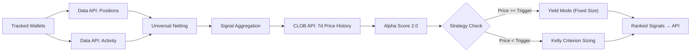
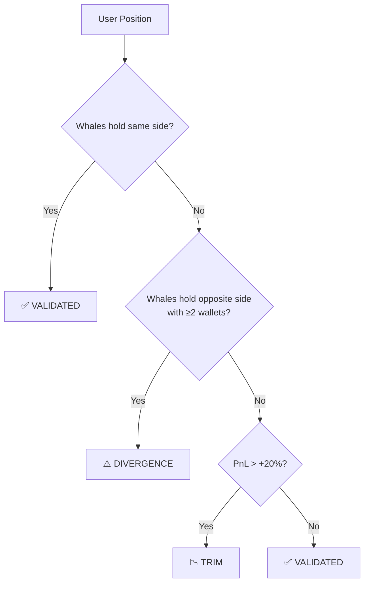

# PolyBot – Polymarket Consensus Terminal

**A whale-tracking and consensus aggregation terminal for Polymarket with Alpha Score 2.0 multi-factor scoring and Kelly Criterion position sizing.**

---

## Table of Contents

1. [Quick Start](#1-quick-start)
2. [Architecture](#2-architecture)
3. [Data Pipeline](#3-data-pipeline)
4. [Polymarket APIs Used](#4-polymarket-apis-used)
5. [Universal Netting](#5-universal-netting)
6. [Signal Aggregation](#6-signal-aggregation)
7. [Alpha Score 2.0](#7-alpha-score-20)
8. [Yield Mode Strategy](#8-yield-mode-strategy)
9. [Fractional Kelly Criterion](#9-fractional-kelly-criterion)
10. [Portfolio Validation](#10-portfolio-validation)
11. [Market Classification](#11-market-classification)
12. [Whale Scoring Engine](#12-whale-scoring-engine)
13. [Consensus Quality Adjustment](#13-consensus-quality-adjustment)
14. [Signal Ranking](#14-signal-ranking)
15. [API Reference](#15-api-reference)
16. [Frontend Architecture](#16-frontend-architecture)
17. [Configuration & Parameters](#17-configuration--parameters)

---

## 1. Quick Start

### Backend

```bash
cd backend
pip install -r requirements.txt
python -m uvicorn app.main:app --reload --port 8000
```

### Frontend

```bash
cd frontend
npm install
npm run dev
```

Frontend is served on `http://localhost:5173`, backend API on `http://localhost:8000`.

---

## 2. Architecture

```
PolyBot/
├── backend/
│   ├── app/
│   │   ├── core/
│   │   │   └── config.py            # Settings via env vars (Pydantic)
│   │   ├── models/
│   │   │   └── schemas.py           # Data models (RawSignal, SignalSchema, etc.)
│   │   ├── services/
│   │   │   ├── polymarket.py        # Gamma API + CLOB API client
│   │   │   ├── chain_data.py        # Polygon RPC (USDC balances)
│   │   │   ├── aggregator.py        # Consensus Engine (core logic)
│   │   │   └── database.py          # SQLite persistence
│   │   └── main.py                  # FastAPI endpoints
│   └── requirements.txt
│
├── frontend/
│   └── src/
│       ├── components/
│       │   ├── terminal/            # SignalsTable, SettingsTab, Header
│       │   └── ui/                  # Tooltip, Badge, etc.
│       ├── hooks/
│       │   ├── useSignals.ts        # Signal fetching + polling
│       │   └── useSettings.ts       # User settings persistence
│       ├── types/
│       │   └── api.ts               # TypeScript interfaces
│       └── App.tsx                   # Root component
│
└── README.md                        # ← You are here
```

### Tech Stack

| Layer | Technology |
|-------|-----------|
| Backend | Python 3.9+, FastAPI, httpx, cachetools, SQLite |
| Frontend | React 18, TypeScript, Vite, TanStack Query, Tailwind CSS |
| Data Sources | Polymarket Gamma API, CLOB API, Data API, Polygon RPC |

---

## 3. Data Pipeline



**Flow per request cycle:**

1. For each tracked whale wallet, **concurrently** fetch active positions and trade activity from the Data API.
2. Map earliest trade timestamp per asset from activity data to each position (for Freshness scoring).
3. Apply universal netting to remove hedged positions within each wallet.
4. Group remaining positions across wallets by `(market_id, outcome_label, direction)`.
5. Fetch 7-day price history from the CLOB API for momentum scoring.
6. Calculate Alpha Score 2.0 (4-factor model) for each aggregated signal.
7. Calculate recommended position size via Fractional Kelly Criterion.
8. Sort by wallet count → alpha score → total conviction and return.

---

## 4. Polymarket APIs Used

PolyBot integrates **three** of Polymarket's four APIs:

| API | Base URL | What We Use It For |
|-----|----------|-------------------|
| **Gamma API** | `https://gamma-api.polymarket.com` | Market discovery, metadata, categories, slugs |
| **CLOB API** | `https://clob.polymarket.com` | 7-day price history for momentum scoring |
| **Data API** | `https://data-api.polymarket.com` | Wallet positions (`/positions`) and trade history with timestamps (`/activity`) |

### CLOB API – Price History Endpoint

Used for momentum scoring (Sub-Factor 2 of Alpha Score 2.0).

```
GET https://clob.polymarket.com/prices-history
    ?market={token_id}       # CLOB token ID (not condition ID)
    &interval=1w             # 1-week lookback
    &fidelity=60             # 1-hour resolution (data points every 60 min)
```

**Response:**

```json
{
  "history": [
    { "t": 1707000000, "p": 0.65 },
    { "t": 1707003600, "p": 0.67 },
    ...
  ]
}
```

The 7-day average is computed as `AVG(p)` over all returned data points.

### Rate Limiting & Caching

- All API calls are rate-limited via `asyncio.Semaphore` (default: 10 concurrent requests).
- Market metadata: cached 60 seconds (`market_cache_ttl`).
- Prices and price history: cached 5 seconds (`price_cache_ttl`).
- Price history for multiple tokens is fetched concurrently via `asyncio.gather()`.

---

## 5. Universal Netting

**Purpose:** Remove hedged positions. If a whale holds both YES and NO on the same market outcome, subtract the smaller side to reveal the net directional bet.

```
For each market per wallet:
    net_yes = yes_size - min(yes_size, no_size)
    net_no  = no_size  - min(yes_size, no_size)
```

| Scenario | YES Size | NO Size | Net YES | Net NO | Interpretation |
|----------|----------|---------|---------|--------|----------------|
| Pure Long | 100 | 0 | 100 | 0 | Bullish |
| Pure Short | 0 | 80 | 0 | 80 | Bearish |
| Partial Hedge | 100 | 40 | 60 | 0 | Net bullish |
| Full Hedge | 50 | 50 | 0 | 0 | No signal (removed) |

**Conviction (USDC):** `net_size × entry_price`

---

## 6. Signal Aggregation

After netting, positions across all tracked wallets are grouped by:

```
group_key = market_id + outcome_label + direction
```

| Metric | Formula | Meaning |
|--------|---------|---------|
| **Wallet Count** | `count(distinct wallets)` | How many whales agree |
| **Total Conviction** | `Σ size_usdc` | Total capital committed |
| **Avg Entry Price** | `Σ(entry × size) / Σ(size)` | Conviction-weighted average entry |
| **Current Price** | Latest from data fetch | Live market price |
| **Token ID** | First non-empty CLOB token | Used for price history lookups |
| **Earliest Timestamp** | `min(timestamp)` across group | Used for freshness scoring |

---

## 7. Alpha Score 2.0

The Alpha Score rates each aggregated signal on a **0–100 scale**. It replaced the original static rule-based system with a dynamic 4-factor model informed by behavioral finance research.

### Master Formula

```
Alpha Score = Clamp(0, 100,  Base + FLB + Momentum + SmartShort + Freshness)
```

| Factor | Range | Default Base |
|--------|-------|-------------|
| Base | — | 50 (neutral midpoint) |
| FLB | -60 to +15 | — |
| Momentum | -10 to +10 | — |
| Smart Short | 0 to +20 | — |
| Freshness | 0 to +10 | — |

### Score Ranges

| Range | Label | Meaning |
|-------|-------|---------|
| 70–100 | **ALPHA** | Strong signal, prioritize |
| 40–69 | *Neutral* | Standard signal |
| 0–39 | **LOTTERY** | High risk, can be filtered |

---

### Sub-Factor 1: Favorite-Longshot Bias (FLB)

**Source:** Wolfers & Zitzewitz, "Prediction Markets" (2004)

The FLB is a well-documented market anomaly: **cheap contracts (longshots) are systematically overpriced** by retail traders who overweight small probabilities, while **expensive contracts (favorites) are systematically underpriced** because bettors avoid low-payout-ratio bets.

PolyBot divides the current market price `p` into four zones:

| Zone | Price Range | Raw Score | Behavior |
|------|------------|-----------|----------|
| **Lottery** | `p < $0.05` | **-40** × `longshot_tolerance` | Massive retail overpricing. Whales buying here are likely wrong. |
| **Hope** | `$0.05 ≤ p < $0.15` | **-20** × `longshot_tolerance` | Moderate overpricing. Penalized less than Lottery. |
| **Confusion** | `$0.15 ≤ p ≤ $0.85` | **0** | Efficiently priced zone. No FLB edge. |
| **Favorite Value** | `p > $0.85` | **+15** | Underpriced due to risk-aversion discount. |

**User-Tunable Parameter:** `longshot_tolerance` (range: 0.5–1.5, default: 1.0)

- At `0.5x`: Lenient — penalties are halved (Lottery = -20 instead of -40)
- At `1.0x`: Default — standard FLB penalties
- At `1.5x`: Strict — penalties are 50% harsher (Lottery = -60 instead of -40)

The Favorite Value zone is **not** scaled by `longshot_tolerance` (it's a fixed +15).

**Example:**

```
Price = $0.08 (Hope Zone), longshot_tolerance = 1.2
FLB Score = int(-20 × 1.2) = -24
```

---

### Sub-Factor 2: Momentum

**Purpose:** Detect breakout or falling-knife signals by comparing the current price to its 7-day moving average.

**Data Source:** CLOB API `prices-history` endpoint (see Section 4).

```
ratio = current_price / 7d_average
pct_diff = (ratio - 1.0) × 100
```

| Condition | Score | Meaning |
|-----------|-------|---------|
| `ratio > 1.05` (price 5%+ above avg) | **+10** | Bullish breakout — price is trending up |
| `ratio < 0.95` (price 5%+ below avg) | **-10** | Falling knife — price is trending down |
| `0.95 ≤ ratio ≤ 1.05` | **0** | Near average, no momentum signal |

**User-Tunable Parameter:** `trend_mode` (boolean, default: `true`)

- When `false`: Momentum is always 0 (disabled).
- When `true`: Momentum is calculated from 7-day price data.
- If price history is unavailable (new market, API error): Momentum defaults to 0.

**Example:**

```
Current Price = $0.72, 7d Average = $0.65
ratio = 0.72 / 0.65 = 1.108
pct_diff = +10.8%
→ Breakout (+10)
```

---

### Sub-Factor 3: Smart Short Score

**Rationale:** Retail prediction market participants have a well-documented **long bias** — they prefer YES bets because of optimism and the desire for positive outcomes. Whales who bet NO are expressing contrarian conviction, which is statistically more likely to contain alpha.

The bonus is sector-weighted because some categories have stronger sentiment biases than others:

| Direction | Sector | Score | Why |
|-----------|--------|-------|-----|
| NO | Sports, Politics | **+20** | Highest public sentiment / desirability bias |
| NO | Entertainment | **+15** | Strong but slightly lower desirability bias |
| NO | Finance, Other | **+10** | More efficient markets, smaller edge |
| YES | *(any)* | **0** | Not penalized, just no extra bonus |

---

### Sub-Factor 4: Freshness / Time Decay

**Purpose:** Recent positions have higher predictive power than stale ones. A position opened today is more informative than one opened two weeks ago.

**Data Source:** Data API `/activity` endpoint. For each tracked wallet, the trade history is fetched and the **earliest trade timestamp per asset** is used as the position open time.

```
GET https://data-api.polymarket.com/activity
    ?user={wallet_address}
    &limit=500

→ Returns list of trades with Unix `timestamp`, `asset`, `conditionId`, `side`, etc.
→ We extract: min(timestamp) per asset → position open time.
```

```
days_since_entry = (now - earliest_trade_timestamp) / 86400
freshness = max(0, floor(10 - 2 × days_since_entry))
```

| Age | Score | Label |
|-----|-------|-------|
| < 1 day | **+10** | Fresh signal |
| 1 day | **+8** | Recent |
| 2 days | **+6** | Recent |
| 3 days | **+4** | Aging |
| 4 days | **+2** | Aging |
| ≥ 5 days | **0** | Stale |

If activity data is unavailable (new wallet, API error), freshness defaults to 0.

---

### Full Calculation Example

| Input | Value |
|-------|-------|
| Direction | YES |
| Current Price | $0.72 |
| Category | Politics |
| 7d Average | $0.65 |
| Earliest Timestamp | 18 hours ago |
| Longshot Tolerance | 1.0 |

```
Base:        50
FLB:          0  →  $0.72 is in Confusion Zone ($0.15–$0.85)
Momentum:   +10  →  ratio = 0.72/0.65 = 1.108 → breakout
Smart Short:  0  →  YES bet, no short bonus
Freshness:   +10  →  < 1 day old

Total = clamp(0, 100, 50 + 0 + 10 + 0 + 10) = 70 → ALPHA
```

---

## 8. Yield Mode Strategy

**New in v2.1:** A specialized strategy for high-probability "safe parking" or arbitrage opportunities where the market is near certainty (e.g., >85¢). In these scenarios, the Kelly Criterion is often too aggressive or volatile, so PolyBot switches to a fixed-allocation model.

### Logic
The Yield Mode overrides the Kelly Speculation engine when **both** conditions are met:

1.  **Price Threshold:** `current_price ≥ yield_trigger_price` (default: $0.85)
2.  **Consensus Threshold:** `wallet_count ≥ yield_min_whales` (default: 3)

### Mechanism
Instead of calculating edge and KELLY fractions, the system allocates a **fixed percentage** of the bankroll.

```python
if price >= yield_trigger_price and count >= yield_min_whales:
    size = user_balance * yield_fixed_pct
    reason = "Yield Mode (Safe Parking)"
```

### Parameters
| Parameter | Default | Description |
|-----------|---------|-------------|
| `yield_trigger_price` | 0.85 | Price above which Yield Mode activates (85¢) |
| `yield_fixed_pct` | 0.10 | Fixed bankroll % to potential allocate (10%) |
| `yield_min_whales` | 3 | Minimum smart money confirmation required |

---

## 9. Fractional Kelly Criterion

The Kelly Criterion calculates the **mathematically optimal bet size** to maximize long-term growth of a bankroll, given an estimate of edge.

### Formula (Step by Step)

The Risk Engine uses a **De-Biased** version of Kelly. It doesn't trust the market price blindly.

```python
Step A — Net Odds:
    b = (1 - price) / price

Step B — Probability Calibration:
    p_market = price
    
    # 1. Apply FLB Correction (Standard J-Curve)
    # Adjusts for retail irrationality at extremes (Hardcoded)
    p_real = apply_flb_correction(p_market)

Step C — Real Probability (with alpha boost):
    # Reward high alpha scores
    if alpha_score ≥ 70:  p_real += 0.05
    
    p_final = min(p_real, 0.85)  # Hard cap

Step D — Kelly Fraction:
    q = 1 - p_final
    f = (p_final * b - q) / b

Step E — Final Sizing:
    if f ≤ 0 → $0 (Negative EV, do not bet)
    stake_pct = f × kelly_multiplier
    final_pct = min(stake_pct, max_risk_cap)
    recommended_size = user_balance × final_pct
```

### Parameter Explanations

| Parameter | Meaning | Default | Range |
|-----------|---------|---------|-------|
| `kelly_multiplier` | Fraction of full Kelly to use. Full Kelly (1.0x) is volatile; fractional (0.25x) is smoother. | 0.25 | 0.1–1.0 |
| `max_risk_cap` | Hard ceiling on any single bet as % of bankroll. | 5% | 1%–20% |
| `prob_cap` | Maximum estimated probability after boosts. Prevents overconfidence. | 0.85 | hardcoded |
| Consensus Boost | +5% to estimated probability when ≥3 whales agree. | +0.05 | — |
| Alpha Boost | +5% to estimated probability when Alpha Score ≥ 70. | +0.05 | — |

### Worked Example

| Input | Value |
|-------|-------|
| Current Price | $0.60 |
| Wallet Count | 4 |
| Alpha Score | 75 |
| User Balance | $10,000 |
| Kelly Multiplier | 0.25 |
| Max Risk Cap | 5% |

```
b = (1 - 0.60) / 0.60 = 0.667
p = 0.60 + 0.05 (consensus) + 0.05 (alpha) = 0.70
q = 0.30
f = (0.70 × 0.667 - 0.30) / 0.667 = 0.250

stake_pct = 0.250 × 0.25 = 0.0625 (6.25%)
final_pct = min(0.0625, 0.05) = 0.05  (capped at 5%)
recommended = $10,000 × 0.05 = $500
```

### Edge Cases

| Condition | Result |
|-----------|--------|
| `price ≤ 0` or `price ≥ 1` | $0, error: "Invalid price" |
| `f ≤ 0` (negative Kelly) | $0, reason: "Negative EV" |
| `stake_pct > max_risk_cap` | Capped at `max_risk_cap` |

---

## 10. Portfolio Validation

When a user connects their wallet, PolyBot compares their positions against whale consensus and assigns a status label.



### PnL Calculation

```
pnl_percent = ((current_price - entry_price) / entry_price) × 100
position_pnl_usdc = size_usdc × (pnl_percent / 100)
```

### Status Rules

| Status | Condition | Action |
|--------|-----------|--------|
| **VALIDATED** | Whales hold same `market + outcome + direction` | Position aligns with smart money |
| **DIVERGENCE** | Whales hold the **opposite** direction with `wallet_count ≥ 2` | You're against consensus — re-evaluate |
| **TRIM** | No whale consensus AND `pnl > +20%` | Consider taking profits |
| **VALIDATED** | No whale consensus in either direction | No conflicting data |

---

## 11. Market Classification

Markets are categorized by matching Gamma API tags against keyword lists:

| Category | Trigger Keywords |
|----------|-----------------|
| **Sports** | `sports`, `nfl`, `nba`, `mlb`, `soccer`, `football` |
| **Politics** | `politics`, `election`, `trump`, `biden`, `congress` |
| **Finance** | `finance`, `crypto`, `bitcoin`, `fed`, `interest` |
| **Entertainment** | `entertainment`, `movies`, `oscars`, `celebrity` |
| **Other** | *(default fallback)* |

Categories affect the **Smart Short** sub-factor of Alpha Score 2.0 (see Section 7.3).

---

## 12. Whale Scoring Engine

**New in v2.1:** PolyBot now rates every tracked wallet on a **0–100 scale** based on four behavioral pillars. This score determines the wallet's influence on the "Consensus Quality" multiplier.

### The 4 Pillars

| Pillar | Weight | Metric | Purpose |
|--------|--------|--------|---------|
| **ROI / Performance** | 35% | Modified Information Ratio | Rewards consistent profitability & high win rate. Penalizes losses. |
| **Discipline** | 25% | Disposition Effect Ratio | Rewards "Diamond Hands". **Score < 30 = BAGHOLDER** (holds losers too long). |
| **Precision** | 20% | Turnover Index | Penalizes overtrading/churning. Rewards "Sniper" behavior. |
| **Timing** | 20% | Pioneer Score | Rewards entering early (contrarian) vs. late (FOMO). |

### Tiers & Tags

| Score | Tier | Visual Tag | Meaning |
|-------|------|------------|---------|
| **80–100** | **ELITE** | `ELITE` (Purple) | Use full position sizing. |
| **60–79** | **PRO** | `PRO` (Green) | Standard high-quality signal. |
| **40–59** | **STD** | `STD` (Grey) | Average performance. |
| **0–39** | **WEAK** | `WEAK` (Red) | Heavily dampened influence. |

---

## 13. Consensus Quality Adjustment

The **Risk Engine** uses the average Whale Score of all participants in a signal to apply a **Confidence Dampener** to the final position size. This ensures you bet big only when the *best* whales agree.

### Formula

```python
avg_score = sum(whale_scores) / count
```

| Average Score | dampener (D) | Size Impact |
|---------------|--------------|-------------|
| **> 80 (Elite)** | **1.00** | **100%** (Full Size) |
| **60–80 (Pro)** | **0.50 – 1.00** | Linear scaling (e.g. 70 → 75% size) |
| **50–60 (Mixed)** | **0.25 – 0.50** | Linear scaling (e.g. 55 → 37.5% size) |
| **< 50 (Weak)** | **0.25** | **25%** (Quarter Size) |

**Example:**
-   Kelly calculates optimal size: **$1,000**
-   Consensus: 3 Whales (Scores: 45, 55, 50) → Avg: 50
-   Dampener: 0.25
-   **Final Bet:** $1,000 × 0.25 = **$250**

---

## 14. Signal Ranking

Final signals are sorted by a **three-tier priority:**

```
ORDER BY
    wallet_count     DESC,   -- More whales = stronger consensus
    alpha_score      DESC,   -- Higher alpha = better edge
    total_conviction DESC    -- More capital = more confidence
```

### User-Configurable Filters

| Filter | Parameter | Default | Effect |
|--------|-----------|---------|--------|
| Hide Lottery | `hide_lottery` | false | Remove signals with `alpha < 30` |
| Longshot Tolerance | `longshot_tolerance` | 1.0 | Scale FLB penalties (0.5–1.5) |
| Trend Mode | `trend_mode` | true | Enable/disable momentum scoring |

---

## 15. API Reference

All endpoints are prefixed with `/api/v1`.

### Signals

| Method | Endpoint | Description |
|--------|----------|-------------|
| `GET` | `/signals` | Ranked consensus signals with Alpha Score + Kelly sizing |

**Query Parameters:**

| Param | Type | Default | Description |
|-------|------|---------|-------------|
| `min_wallets` | int | 1 | Minimum whale consensus (1–10) |
| `user_balance` | float | 1000 | USDC balance for position sizing |
| `kelly_multiplier` | float | 0.25 | Kelly fraction (0.1–1.0) |
| `max_risk_cap` | float | 0.05 | Max risk per trade (0.01–0.20) |
| `max_risk_cap` | float | 0.05 | Max risk per trade (0.01–0.20) |
| `hide_lottery` | bool | false | Hide Alpha < 30 |
| `ignore_bagholders` | bool | true | Hide signals from Discipline < 30 |
| `longshot_tolerance` | float | 1.0 | FLB penalty scaling (0.5–1.5) |
| `trend_mode` | bool | true | Enable momentum scoring |
| `yield_trigger_price` | float | 0.85 | Yield Mode activation price |
| `yield_fixed_pct` | float | 0.10 | Yield Mode fixed size |
| `yield_min_whales` | int | 3 | Yield Mode min consensus |

### Portfolio

| Method | Endpoint | Description |
|--------|----------|-------------|
| `GET` | `/user/portfolio?wallet={address}` | Portfolio vs whale consensus |
| `GET` | `/user/balance?wallet={address}` | USDC balance on Polygon |

### Wallet Configuration

| Method | Endpoint | Description |
|--------|----------|-------------|
| `GET` | `/config/wallets` | List tracked wallets |
| `POST` | `/config/wallets` | Add/remove wallet `{action, address}` |
| `PUT` | `/config/wallet-name` | Set display name for a wallet |

### Settings
 
 | Method | Endpoint | Description |
 |--------|----------|-------------|
 | `GET` | `/settings` | Get current settings |
 | `PUT` | `/settings` | Update settings (partial update) |
 
 Settings persist to SQLite and include: `kelly_multiplier`, `max_risk_cap`, `min_wallets`, `hide_lottery`, `connected_wallet`, `longshot_tolerance`, `trend_mode`, `yield_trigger_price`, `yield_fixed_pct`, `yield_min_whales`.

### Health

| Method | Endpoint | Description |
|--------|----------|-------------|
| `GET` | `/` | Quick status check |
| `GET` | `/health` | Detailed health (tracked wallets, cache, DB) |

---

## 16. Frontend Architecture

| Component | File | Purpose |
|-----------|------|---------|
| **App** | `App.tsx` | Root layout, tab navigation |
| **SignalsTable** | `terminal/SignalsTable.tsx` | Main data table with TanStack Table |
| **SettingsTab** | `terminal/SettingsTab.tsx` | Risk config, wallet management |
| **Tooltip** | `ui/Tooltip.tsx` | Alpha/Kelly/Yield breakdown tooltips |

### Performance Optimization
**Debounced Settings:** The `SettingsTab` uses a local state buffer to provide **immediate visual feedback** while dragging sliders, but debounces the API write by **500ms**. This prevents flooding the backend with hundreds of requests during a single interaction.

### UI / UX Visuals
-   **Consensus Column:** Displays a heatmap bar that glows **purple** (Elite status) when high-tier whales are present.
-   **Yield Mode:** Displays a specialized "Yield Active" tooltip with fixed allocation details instead of Kelly math.

### Hooks

| Hook | File | Purpose |
|------|------|---------|
| `useSignals` | `hooks/useSignals.ts` | Fetches signals every 5s via TanStack Query |
| `useSettings` | `hooks/useSettings.ts` | Persists settings to backend + localStorage |

### Key Types (`api.ts`)

| Type | Fields |
|------|--------|
| `Signal` | `group_key`, `market_id`, `direction`, `alpha_score`, `alpha_breakdown`, `recommended_size`, etc. |
| `AlphaBreakdown` | `base`, `flb`, `momentum`, `smart_short`, `freshness`, `total`, `details[]` |
| `RiskSettings` | `kellyMultiplier`, `maxRiskCap`, `minWallets`, `hideLottery`, `longshotTolerance`, `trendMode` |

---

## 17. Configuration & Parameters

### Environment Variables (`.env`)

| Variable | Default | Description |
|----------|---------|-------------|
| `POLYGON_RPC_URL` | `https://polygon-rpc.com` | Polygon RPC for balance queries |
| `GAMMA_API_BASE_URL` | `https://gamma-api.polymarket.com` | Gamma API base |
| `RATE_LIMIT_REQUESTS_PER_SECOND` | 10 | API rate limit |
| `MARKET_CACHE_TTL` | 60 | Market metadata cache (seconds) |
| `PRICE_CACHE_TTL` | 5 | Price data cache (seconds) |
| `DEFAULT_RISK_PERCENT` | 0.05 | Default risk % |
| `DEFAULT_USER_BALANCE` | 1000 | Default USDC balance |

### All Tunable Parameters (Summary)

| Parameter | Default | Range | Location |
|-----------|---------|-------|----------|
| Kelly Multiplier | 0.25 | 0.1–1.0 | Settings UI / API |
| Max Risk Cap | 5% | 1%–20% | Settings UI / API |
| Min Wallets | 2 | 1–10 | Settings UI / API |
| Longshot Tolerance | 1.0 | 0.5–1.5 | Settings UI / API |
| Trend Mode | true | on/off | Settings UI / API |
| Yield Trigger | 0.85 | 0.50–0.99 | Settings UI / API |
| Yield Fixed % | 10% | 1%–50% | Settings UI / API |
| Yield Min Whales | 3 | 1–5 | Settings UI / API |
| Probability Cap | 0.85 | — | Hardcoded in aggregator |
| Alpha Boost | +0.05 | — | Hardcoded in Kelly |
| Divergence Min Wallets | ≥ 2 | — | Hardcoded in portfolio |
| Trim PnL Threshold | > 20% | — | Hardcoded in portfolio |
| FLB Zone Boundaries | 0.05 / 0.15 / 0.85 | — | Hardcoded in aggregator |
| Momentum Thresholds | ±5% | — | Hardcoded in aggregator |
| Freshness Decay | 2 pts/day | — | Hardcoded in aggregator |

---

## License

MIT
