# PolyBot – Polymarket Consensus Terminal

**A whale-tracking and consensus aggregation terminal for Polymarket with Alpha Score 2.0 multi-factor scoring and Kelly Criterion position sizing.**

---

## Table of Contents

1. [Quick Start](#1-quick-start)
2. [Architecture](#2-architecture)
3. [Data Pipeline](#3-data-pipeline)
4. [Polymarket APIs Used](#4-polymarket-apis-used)
5. [Universal Netting](#5-universal-netting)
6. [Signal Aggregation](#6-signal-aggregation)
7. [Alpha Score 2.0](#7-alpha-score-20)
8. [Fractional Kelly Criterion](#8-fractional-kelly-criterion)
9. [Portfolio Validation](#9-portfolio-validation)
10. [Market Classification](#10-market-classification)
11. [Signal Ranking](#11-signal-ranking)
12. [API Reference](#12-api-reference)
13. [Frontend Architecture](#13-frontend-architecture)
14. [Configuration & Parameters](#14-configuration--parameters)

---

## 1. Quick Start

### Backend

```bash
cd backend
pip install -r requirements.txt
python -m uvicorn app.main:app --reload --port 8000
```

### Frontend

```bash
cd frontend
npm install
npm run dev
```

Frontend is served on `http://localhost:5173`, backend API on `http://localhost:8000`.

---

## 2. Architecture

```
PolyBot/
├── backend/
│   ├── app/
│   │   ├── core/
│   │   │   └── config.py            # Settings via env vars (Pydantic)
│   │   ├── models/
│   │   │   └── schemas.py           # Data models (RawSignal, SignalSchema, etc.)
│   │   ├── services/
│   │   │   ├── polymarket.py        # Gamma API + CLOB API client
│   │   │   ├── chain_data.py        # Polygon RPC (USDC balances)
│   │   │   ├── aggregator.py        # Consensus Engine (core logic)
│   │   │   └── database.py          # SQLite persistence
│   │   └── main.py                  # FastAPI endpoints
│   └── requirements.txt
│
├── frontend/
│   └── src/
│       ├── components/
│       │   ├── terminal/            # SignalsTable, SettingsTab, Header
│       │   └── ui/                  # Tooltip, Badge, etc.
│       ├── hooks/
│       │   ├── useSignals.ts        # Signal fetching + polling
│       │   └── useSettings.ts       # User settings persistence
│       ├── types/
│       │   └── api.ts               # TypeScript interfaces
│       └── App.tsx                   # Root component
│
└── README.md                        # ← You are here
```

### Tech Stack

| Layer | Technology |
|-------|-----------|
| Backend | Python 3.9+, FastAPI, httpx, cachetools, SQLite |
| Frontend | React 18, TypeScript, Vite, TanStack Query, Tailwind CSS |
| Data Sources | Polymarket Gamma API, CLOB API, Data API, Polygon RPC |

---

## 3. Data Pipeline

```mermaid
graph LR
    A[Tracked Wallets] --> B[Data API: Positions]
    B --> C[Universal Netting]
    C --> D[Signal Aggregation]
    D --> E[CLOB API: 7d Price History]
    E --> F["Alpha Score 2.0"]
    F --> G[Kelly Criterion Sizing]
    G --> H[Ranked Signals → API]
```



**Flow per request cycle:**

1. For each tracked whale wallet, fetch all active positions from the Polymarket Data API.
2. Apply universal netting to remove hedged positions within each wallet.
3. Group remaining positions across wallets by `(market_id, outcome_label, direction)`.
4. Fetch 7-day price history from the CLOB API for momentum scoring.
5. Calculate Alpha Score 2.0 (4-factor model) for each aggregated signal.
6. Calculate recommended position size via Fractional Kelly Criterion.
7. Sort by wallet count → alpha score → total conviction and return.

---

## 4. Polymarket APIs Used

PolyBot integrates **three** of Polymarket's four APIs:

| API | Base URL | What We Use It For |
|-----|----------|-------------------|
| **Gamma API** | `https://gamma-api.polymarket.com` | Market discovery, metadata, categories, slugs |
| **CLOB API** | `https://clob.polymarket.com` | 7-day price history for momentum scoring |
| **Data API** | `https://data-api.polymarket.com` | Wallet positions (the primary data source) |

### CLOB API – Price History Endpoint

Used for momentum scoring (Sub-Factor 2 of Alpha Score 2.0).

```
GET https://clob.polymarket.com/prices-history
    ?market={token_id}       # CLOB token ID (not condition ID)
    &interval=1w             # 1-week lookback
    &fidelity=60             # 1-hour resolution (data points every 60 min)
```

**Response:**

```json
{
  "history": [
    { "t": 1707000000, "p": 0.65 },
    { "t": 1707003600, "p": 0.67 },
    ...
  ]
}
```

The 7-day average is computed as `AVG(p)` over all returned data points.

### Rate Limiting & Caching

- All API calls are rate-limited via `asyncio.Semaphore` (default: 10 concurrent requests).
- Market metadata: cached 60 seconds (`market_cache_ttl`).
- Prices and price history: cached 5 seconds (`price_cache_ttl`).
- Price history for multiple tokens is fetched concurrently via `asyncio.gather()`.

---

## 5. Universal Netting

**Purpose:** Remove hedged positions. If a whale holds both YES and NO on the same market outcome, subtract the smaller side to reveal the net directional bet.

```
For each market per wallet:
    net_yes = yes_size - min(yes_size, no_size)
    net_no  = no_size  - min(yes_size, no_size)
```

| Scenario | YES Size | NO Size | Net YES | Net NO | Interpretation |
|----------|----------|---------|---------|--------|----------------|
| Pure Long | 100 | 0 | 100 | 0 | Bullish |
| Pure Short | 0 | 80 | 0 | 80 | Bearish |
| Partial Hedge | 100 | 40 | 60 | 0 | Net bullish |
| Full Hedge | 50 | 50 | 0 | 0 | No signal (removed) |

**Conviction (USDC):** `net_size × entry_price`

---

## 6. Signal Aggregation

After netting, positions across all tracked wallets are grouped by:

```
group_key = market_id + outcome_label + direction
```

| Metric | Formula | Meaning |
|--------|---------|---------|
| **Wallet Count** | `count(distinct wallets)` | How many whales agree |
| **Total Conviction** | `Σ size_usdc` | Total capital committed |
| **Avg Entry Price** | `Σ(entry × size) / Σ(size)` | Conviction-weighted average entry |
| **Current Price** | Latest from data fetch | Live market price |
| **Token ID** | First non-empty CLOB token | Used for price history lookups |
| **Earliest Timestamp** | `min(timestamp)` across group | Used for freshness scoring |

---

## 7. Alpha Score 2.0

The Alpha Score rates each aggregated signal on a **0–100 scale**. It replaced the original static rule-based system with a dynamic 4-factor model informed by behavioral finance research.

### Master Formula

```
Alpha Score = Clamp(0, 100,  Base + FLB + Momentum + SmartShort + Freshness)
```

| Factor | Range | Default Base |
|--------|-------|-------------|
| Base | — | 50 (neutral midpoint) |
| FLB | -60 to +15 | — |
| Momentum | -10 to +10 | — |
| Smart Short | 0 to +20 | — |
| Freshness | 0 to +10 | — |

### Score Ranges

| Range | Label | Meaning |
|-------|-------|---------|
| 70–100 | **ALPHA** | Strong signal, prioritize |
| 40–69 | *Neutral* | Standard signal |
| 0–39 | **LOTTERY** | High risk, can be filtered |

---

### Sub-Factor 1: Favorite-Longshot Bias (FLB)

**Source:** Wolfers & Zitzewitz, "Prediction Markets" (2004)

The FLB is a well-documented market anomaly: **cheap contracts (longshots) are systematically overpriced** by retail traders who overweight small probabilities, while **expensive contracts (favorites) are systematically underpriced** because bettors avoid low-payout-ratio bets.

PolyBot divides the current market price `p` into four zones:

| Zone | Price Range | Raw Score | Behavior |
|------|------------|-----------|----------|
| **Lottery** | `p < $0.05` | **-40** × `longshot_tolerance` | Massive retail overpricing. Whales buying here are likely wrong. |
| **Hope** | `$0.05 ≤ p < $0.15` | **-20** × `longshot_tolerance` | Moderate overpricing. Penalized less than Lottery. |
| **Confusion** | `$0.15 ≤ p ≤ $0.85` | **0** | Efficiently priced zone. No FLB edge. |
| **Favorite Value** | `p > $0.85` | **+15** | Underpriced due to risk-aversion discount. |

**User-Tunable Parameter:** `longshot_tolerance` (range: 0.5–1.5, default: 1.0)

- At `0.5x`: Lenient — penalties are halved (Lottery = -20 instead of -40)
- At `1.0x`: Default — standard FLB penalties
- At `1.5x`: Strict — penalties are 50% harsher (Lottery = -60 instead of -40)

The Favorite Value zone is **not** scaled by `longshot_tolerance` (it's a fixed +15).

**Example:**

```
Price = $0.08 (Hope Zone), longshot_tolerance = 1.2
FLB Score = int(-20 × 1.2) = -24
```

---

### Sub-Factor 2: Momentum

**Purpose:** Detect breakout or falling-knife signals by comparing the current price to its 7-day moving average.

**Data Source:** CLOB API `prices-history` endpoint (see Section 4).

```
ratio = current_price / 7d_average
pct_diff = (ratio - 1.0) × 100
```

| Condition | Score | Meaning |
|-----------|-------|---------|
| `ratio > 1.05` (price 5%+ above avg) | **+10** | Bullish breakout — price is trending up |
| `ratio < 0.95` (price 5%+ below avg) | **-10** | Falling knife — price is trending down |
| `0.95 ≤ ratio ≤ 1.05` | **0** | Near average, no momentum signal |

**User-Tunable Parameter:** `trend_mode` (boolean, default: `true`)

- When `false`: Momentum is always 0 (disabled).
- When `true`: Momentum is calculated from 7-day price data.
- If price history is unavailable (new market, API error): Momentum defaults to 0.

**Example:**

```
Current Price = $0.72, 7d Average = $0.65
ratio = 0.72 / 0.65 = 1.108
pct_diff = +10.8%
→ Breakout (+10)
```

---

### Sub-Factor 3: Smart Short Score

**Rationale:** Retail prediction market participants have a well-documented **long bias** — they prefer YES bets because of optimism and the desire for positive outcomes. Whales who bet NO are expressing contrarian conviction, which is statistically more likely to contain alpha.

The bonus is sector-weighted because some categories have stronger sentiment biases than others:

| Direction | Sector | Score | Why |
|-----------|--------|-------|-----|
| NO | Sports, Politics | **+20** | Highest public sentiment / desirability bias |
| NO | Entertainment | **+15** | Strong but slightly lower desirability bias |
| NO | Finance, Other | **+10** | More efficient markets, smaller edge |
| YES | *(any)* | **0** | Not penalized, just no extra bonus |

---

### Sub-Factor 4: Freshness / Time Decay

**Purpose:** Recent positions have higher predictive power than stale ones. A position opened today is more informative than one opened two weeks ago.

```
days_since_entry = (now - earliest_timestamp) / 86400
freshness = max(0, floor(10 - 2 × days_since_entry))
```

| Age | Score | Label |
|-----|-------|-------|
| < 1 day | **+10** | Fresh signal |
| 1 day | **+8** | Recent |
| 2 days | **+6** | Recent |
| 3 days | **+4** | Aging |
| 4 days | **+2** | Aging |
| ≥ 5 days | **0** | Stale |

If no timestamp data is available (API doesn't return `createdAt`), freshness defaults to 0.

---

### Full Calculation Example

| Input | Value |
|-------|-------|
| Direction | YES |
| Current Price | $0.72 |
| Category | Politics |
| 7d Average | $0.65 |
| Earliest Timestamp | 18 hours ago |
| Longshot Tolerance | 1.0 |

```
Base:        50
FLB:          0  →  $0.72 is in Confusion Zone ($0.15–$0.85)
Momentum:   +10  →  ratio = 0.72/0.65 = 1.108 → breakout
Smart Short:  0  →  YES bet, no short bonus
Freshness:   +10  →  < 1 day old

Total = clamp(0, 100, 50 + 0 + 10 + 0 + 10) = 70 → ALPHA
```

---

## 8. Fractional Kelly Criterion

The Kelly Criterion calculates the **mathematically optimal bet size** to maximize long-term growth of a bankroll, given an estimate of edge.

### Formula (Step by Step)

```
Step A — Net Odds:
    b = (1 - price) / price

Step B — Real Probability (with consensus boosts):
    p = price
    if wallet_count ≥ 3:  p += 0.05    → Consensus boost
    if alpha_score ≥ 70:  p += 0.05    → Alpha boost
    p = min(p, 0.85)                    → Hard cap

Step C — Kelly Fraction:
    q = 1 - p
    f = (p × b - q) / b

Step D — Final Sizing:
    if f ≤ 0 → $0 (Negative EV, do not bet)
    stake_pct = f × kelly_multiplier
    final_pct = min(stake_pct, max_risk_cap)
    recommended_size = user_balance × final_pct
```

### Parameter Explanations

| Parameter | Meaning | Default | Range |
|-----------|---------|---------|-------|
| `kelly_multiplier` | Fraction of full Kelly to use. Full Kelly (1.0x) is volatile; fractional (0.25x) is smoother. | 0.25 | 0.1–1.0 |
| `max_risk_cap` | Hard ceiling on any single bet as % of bankroll. | 5% | 1%–20% |
| `prob_cap` | Maximum estimated probability after boosts. Prevents overconfidence. | 0.85 | hardcoded |
| Consensus Boost | +5% to estimated probability when ≥3 whales agree. | +0.05 | — |
| Alpha Boost | +5% to estimated probability when Alpha Score ≥ 70. | +0.05 | — |

### Worked Example

| Input | Value |
|-------|-------|
| Current Price | $0.60 |
| Wallet Count | 4 |
| Alpha Score | 75 |
| User Balance | $10,000 |
| Kelly Multiplier | 0.25 |
| Max Risk Cap | 5% |

```
b = (1 - 0.60) / 0.60 = 0.667
p = 0.60 + 0.05 (consensus) + 0.05 (alpha) = 0.70
q = 0.30
f = (0.70 × 0.667 - 0.30) / 0.667 = 0.250

stake_pct = 0.250 × 0.25 = 0.0625 (6.25%)
final_pct = min(0.0625, 0.05) = 0.05  (capped at 5%)
recommended = $10,000 × 0.05 = $500
```

### Edge Cases

| Condition | Result |
|-----------|--------|
| `price ≤ 0` or `price ≥ 1` | $0, error: "Invalid price" |
| `f ≤ 0` (negative Kelly) | $0, reason: "Negative EV" |
| `stake_pct > max_risk_cap` | Capped at `max_risk_cap` |

---

## 9. Portfolio Validation

When a user connects their wallet, PolyBot compares their positions against whale consensus and assigns a status label.

```mermaid
flowchart TD
    A[User Position] --> B{Whales hold same side?}
    B -->|Yes| C["✅ VALIDATED"]
    B -->|No| D{"Whales hold opposite side<br/>with ≥2 wallets?"}
    D -->|Yes| E["⚠️ DIVERGENCE"]
    D -->|No| F{"PnL > +20%?"}
    F -->|Yes| G["📉 TRIM"]
    F -->|No| H["✅ VALIDATED"]
```



### PnL Calculation

```
pnl_percent = ((current_price - entry_price) / entry_price) × 100
position_pnl_usdc = size_usdc × (pnl_percent / 100)
```

### Status Rules

| Status | Condition | Action |
|--------|-----------|--------|
| **VALIDATED** | Whales hold same `market + outcome + direction` | Position aligns with smart money |
| **DIVERGENCE** | Whales hold the **opposite** direction with `wallet_count ≥ 2` | You're against consensus — re-evaluate |
| **TRIM** | No whale consensus AND `pnl > +20%` | Consider taking profits |
| **VALIDATED** | No whale consensus in either direction | No conflicting data |

---

## 10. Market Classification

Markets are categorized by matching Gamma API tags against keyword lists:

| Category | Trigger Keywords |
|----------|-----------------|
| **Sports** | `sports`, `nfl`, `nba`, `mlb`, `soccer`, `football` |
| **Politics** | `politics`, `election`, `trump`, `biden`, `congress` |
| **Finance** | `finance`, `crypto`, `bitcoin`, `fed`, `interest` |
| **Entertainment** | `entertainment`, `movies`, `oscars`, `celebrity` |
| **Other** | *(default fallback)* |

Categories affect the **Smart Short** sub-factor of Alpha Score 2.0 (see Section 7.3).

---

## 11. Signal Ranking

Final signals are sorted by a **three-tier priority:**

```
ORDER BY
    wallet_count     DESC,   -- More whales = stronger consensus
    alpha_score      DESC,   -- Higher alpha = better edge
    total_conviction DESC    -- More capital = more confidence
```

### User-Configurable Filters

| Filter | Parameter | Default | Effect |
|--------|-----------|---------|--------|
| Min Consensus | `min_wallets` | 2 | Hide signals with fewer whales |
| Hide Lottery | `hide_lottery` | false | Remove signals with `alpha < 30` |
| Longshot Tolerance | `longshot_tolerance` | 1.0 | Scale FLB penalties (0.5–1.5) |
| Trend Mode | `trend_mode` | true | Enable/disable momentum scoring |

---

## 12. API Reference

All endpoints are prefixed with `/api/v1`.

### Signals

| Method | Endpoint | Description |
|--------|----------|-------------|
| `GET` | `/signals` | Ranked consensus signals with Alpha Score + Kelly sizing |

**Query Parameters:**

| Param | Type | Default | Description |
|-------|------|---------|-------------|
| `min_wallets` | int | 1 | Minimum whale consensus (1–10) |
| `user_balance` | float | 1000 | USDC balance for position sizing |
| `kelly_multiplier` | float | 0.25 | Kelly fraction (0.1–1.0) |
| `max_risk_cap` | float | 0.05 | Max risk per trade (0.01–0.20) |
| `hide_lottery` | bool | false | Hide Alpha < 30 |
| `longshot_tolerance` | float | 1.0 | FLB penalty scaling (0.5–1.5) |
| `trend_mode` | bool | true | Enable momentum scoring |

### Portfolio

| Method | Endpoint | Description |
|--------|----------|-------------|
| `GET` | `/user/portfolio?wallet={address}` | Portfolio vs whale consensus |
| `GET` | `/user/balance?wallet={address}` | USDC balance on Polygon |

### Wallet Configuration

| Method | Endpoint | Description |
|--------|----------|-------------|
| `GET` | `/config/wallets` | List tracked wallets |
| `POST` | `/config/wallets` | Add/remove wallet `{action, address}` |
| `PUT` | `/config/wallet-name` | Set display name for a wallet |

### Settings

| Method | Endpoint | Description |
|--------|----------|-------------|
| `GET` | `/settings` | Get current settings |
| `PUT` | `/settings` | Update settings (partial update) |

Settings persist to SQLite and include: `kelly_multiplier`, `max_risk_cap`, `min_wallets`, `hide_lottery`, `connected_wallet`, `longshot_tolerance`, `trend_mode`.

### Health

| Method | Endpoint | Description |
|--------|----------|-------------|
| `GET` | `/` | Quick status check |
| `GET` | `/health` | Detailed health (tracked wallets, cache, DB) |

---

## 13. Frontend Architecture

| Component | File | Purpose |
|-----------|------|---------|
| **App** | `App.tsx` | Root layout, tab navigation |
| **SignalsTable** | `terminal/SignalsTable.tsx` | Main data table with TanStack Table |
| **SettingsTab** | `terminal/SettingsTab.tsx` | Risk config, wallet management |
| **Tooltip** | `ui/Tooltip.tsx` | Alpha breakdown + Kelly breakdown tooltips |

### Hooks

| Hook | File | Purpose |
|------|------|---------|
| `useSignals` | `hooks/useSignals.ts` | Fetches signals every 5s via TanStack Query |
| `useSettings` | `hooks/useSettings.ts` | Persists settings to backend + localStorage |

### Key Types (`api.ts`)

| Type | Fields |
|------|--------|
| `Signal` | `group_key`, `market_id`, `direction`, `alpha_score`, `alpha_breakdown`, `recommended_size`, etc. |
| `AlphaBreakdown` | `base`, `flb`, `momentum`, `smart_short`, `freshness`, `total`, `details[]` |
| `RiskSettings` | `kellyMultiplier`, `maxRiskCap`, `minWallets`, `hideLottery`, `longshotTolerance`, `trendMode` |

---

## 14. Configuration & Parameters

### Environment Variables (`.env`)

| Variable | Default | Description |
|----------|---------|-------------|
| `POLYGON_RPC_URL` | `https://polygon-rpc.com` | Polygon RPC for balance queries |
| `GAMMA_API_BASE_URL` | `https://gamma-api.polymarket.com` | Gamma API base |
| `RATE_LIMIT_REQUESTS_PER_SECOND` | 10 | API rate limit |
| `MARKET_CACHE_TTL` | 60 | Market metadata cache (seconds) |
| `PRICE_CACHE_TTL` | 5 | Price data cache (seconds) |
| `DEFAULT_RISK_PERCENT` | 0.05 | Default risk % |
| `DEFAULT_USER_BALANCE` | 1000 | Default USDC balance |

### All Tunable Parameters (Summary)

| Parameter | Default | Range | Location |
|-----------|---------|-------|----------|
| Kelly Multiplier | 0.25 | 0.1–1.0 | Settings UI / API |
| Max Risk Cap | 5% | 1%–20% | Settings UI / API |
| Min Wallets | 2 | 1–10 | Settings UI / API |
| Longshot Tolerance | 1.0 | 0.5–1.5 | Settings UI / API |
| Trend Mode | true | on/off | Settings UI / API |
| Probability Cap | 0.85 | — | Hardcoded in aggregator |
| Consensus Boost | +0.05 | — | Hardcoded in Kelly |
| Alpha Boost | +0.05 | — | Hardcoded in Kelly |
| Divergence Min Wallets | ≥ 2 | — | Hardcoded in portfolio |
| Trim PnL Threshold | > 20% | — | Hardcoded in portfolio |
| FLB Zone Boundaries | 0.05 / 0.15 / 0.85 | — | Hardcoded in aggregator |
| Momentum Thresholds | ±5% | — | Hardcoded in aggregator |
| Freshness Decay | 2 pts/day | — | Hardcoded in aggregator |

---

## License

MIT
